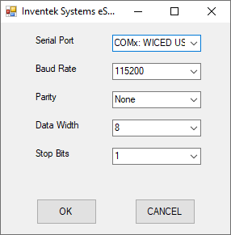
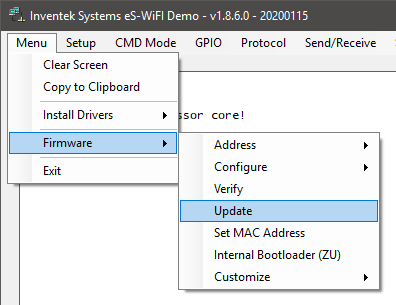

# Shield layer {#page_shield_layer}

The **[Shield layer](https://github.com/Open-CMSIS-Pack/cmsis-toolbox/blob/main/docs/ReferenceApplications.md#shield-layer)** adds support for additional hardware via plugin shields.

## WiFi Shields

The \ref pack_content provides implementations of **Shield layers** for the following Arduino Uno WiFi shields:

| Shield layer                                       | Description                                          |
|----------------------------------------------------|------------------------------------------------------|
| **[Inventek_ISMART43362-E](#layer_ismart43362_e)** | Shield layer for Inventek ISMART43362-E WiFi Shield. |
| **[Sparkfun_DA16200](#layer_da16200)**             | Shield layer for Sparkfun DA16200WiFi Shield.        |
| **[Sparkfun_ESP8266](#layer_esp8266)**             | Shield layer for Sparkfun ESP8266 WiFi Shield.       |
| **[WizNet_WizFi360-EVB](#layer_wizfi360_evb)**     | Shield layer for WizNet WizFi360-EVB WiFi Shield.    |

### Inventek ISMART43362-E {#layer_ismart43362_e}

Shield layer for [Inventek ISMART43362-E](https://www.inventeksys.com/ismart43362-arduino-shields-wi-fi) Arduino Uno WiFi Shield. The shield is connected via an Arduino header using an SPI interface.

| Provided API Interface    | Description                    |
|---------------------------|--------------------------------|
| CMSIS_WIFI                | CMSIS-Driver WIFI (instance 0) |

| Consumed API Interface    | Description                                                    |
|---------------------------|----------------------------------------------------------------|
| ARDUINO_UNO_SPI           | CMSIS-Driver SPI connected to Arduino SPI pins D11..D13        |
| ARDUINO_UNO_D9,D10        | CMSIS-Driver GPIO connected to Arduino digital I/O pins D9,D10 |
| CMSIS-RTOS2               | CMSIS-RTOS2 compliant RTOS                                     |

#### Firmware {#inventek_ismart43362-e_firmware}

The ISMART43362-E Shield has two options to communicate with the underlying target hardware: UART and SPI.  
By default, the module is flashed with the firmware for UART communication.  
To enable SPI communication, follow these steps to flash the module:

**Prepare the hardware**

- Set the power supply jumper on ISMART43362-E to connect 5V_USB and 5V_BOARD.
- Set the SW3 switch to position 1 (factory default position).

**Prepare the software**

- Download [ISM43362_M3G_L44_SPI_C6.2.1.7.zip](https://www.inventeksys.com/iwin/wp-content/uploads/ISM43362_M3G_L44_SPI_C6.2.1.7.zip) and extract it locally.
- Download [eS-WIFi_Demo](https://www.inventeksys.com/iwin/wp-content/uploads/eS-WIFi_Demo.zip)
- Unzip the file and install the application on your PC.
- Start es-WiFi Demo and select **Menu - Install Drivers** and install both, CYW9WCD1EVAL1 and BCM9WCD1EVAL1:
  
- Connect the ISMART43362-E to the PC using the Mini-USB connector. In Device Manager, you should see WICED USB Serial Port (COMx).
- If not already done, assign a low COM port number.
- In the es-WiFi Demo application, execute:
  - Go to **Setup - Serial Port - Configure/Open**:  
    
  - Check the following settings (Serial Port being the one added just now):  
    
  - Go to **Menu - Firmware - Update**:  
    
  - Select the binary image file extracted in the first step (ISM43362_M3G_L44_SPI_C6.2.1.7.bin). Make sure it is an SPI firmware variant:  
    
- After the firmware is updated, the console will show the message "Resetting...":  
  
  You can now disconnect the module from the PC as it contains the new SPI firmware.

  If you want to flash a different firmware later, please visit [Inventek's Firmware page](https://www.inventeksys.com/iwin/firmware/) for the latest binary files.

**Note:** Firmware version ISM43362_M3G_L44_SPI_C6.2.1.8 is not supported!

### Sparkfun DA16200 {#layer_da16200}

Shield layer for [Sparkfun DA16200](https://www.sparkfun.com/products/18567) Arduino Uno WiFi Shield. The shield is connected via an Arduino header using an UART interface.

| Provided API Interface    | Description                    |
|---------------------------|--------------------------------|
| CMSIS_WIFI                | CMSIS-Driver WIFI (instance 0) |

| Consumed API Interface    | Description                                              |
|---------------------------|----------------------------------------------------------|
| ARDUINO_UNO_UART          | CMSIS-Driver USART connected to Arduino UART pins D0..D1 |
| CMSIS-RTOS2               | CMSIS-RTOS2 compliant RTOS                               |

### Sparkfun ESP8266 {#layer_esp8266}

Shield layer for [Sparkfun ESP8266](https://www.sparkfun.com/products/13287) Arduino Uno WiFi Shield. The shield is connected via an Arduino header using an UART interface.

| Provided API Interface    | Description                    |
|---------------------------|--------------------------------|
| CMSIS_WIFI                | CMSIS-Driver WIFI (instance 0) |

| Consumed API Interface    | Description                                              |
|---------------------------|----------------------------------------------------------|
| ARDUINO_UNO_UART          | CMSIS-Driver USART connected to Arduino UART pins D0..D1 |
| CMSIS-RTOS2               | CMSIS-RTOS2 compliant RTOS                               |

#### Important considerations

For correct operation of the Sparkfun ESP8266 WiFi Shield using the **Arduino R3** header, make sure that the jumpers are fitted as described in the table below:

| Jumper | Setting |
|:------:|:-------:|
| J26    | closed  |
| J27    | 1-2     |

For correct operation, the Sparkfun ESP8266 WiFi Shield requires a proper reset functionality ensured by connecting together the **RESET** pin on the Arduino connector with the **RST** pin in the area marked as **ESP8266 GPIO**, see the picture below:

For stable operation, make sure that you are using an external **DC 5V** power supply (connected to **J2**).  
Also, fit a jumper **J1** to **1-2** closed and set the switch **SW1** to position **2-3**.

### WizNet WizFi360-EVB {#layer_wizfi360_evb}

Shield layer for [WizNet WizFi360-EVB](https://docs.wiznet.io/Product/Wi-Fi-Module/WizFi360/wizfi360_evb_shield) Arduino Uno WiFi Shield. The shield is connected via an Arduino header using an UART interface.

| Provided API Interface    | Description                    |
|---------------------------|--------------------------------|
| CMSIS_WIFI                | CMSIS-Driver WIFI (instance 0) |

| Consumed API Interface    | Description                                              |
|---------------------------|----------------------------------------------------------|
| ARDUINO_UNO_UART          | CMSIS-Driver USART connected to Arduino UART pins D0..D1 |
| CMSIS-RTOS2               | CMSIS-RTOS2 compliant RTOS                               |

#### Firmware

The latest firmware images are available on the GitHub: https://github.com/wizfi/Release.

Instructions on how to flash the firmware onto the device can be found on the WIZnet Documents page: https://docs.wiznet.io/Product/Wi-Fi-Module/WizFi360/documents#firmware-update-guide.
